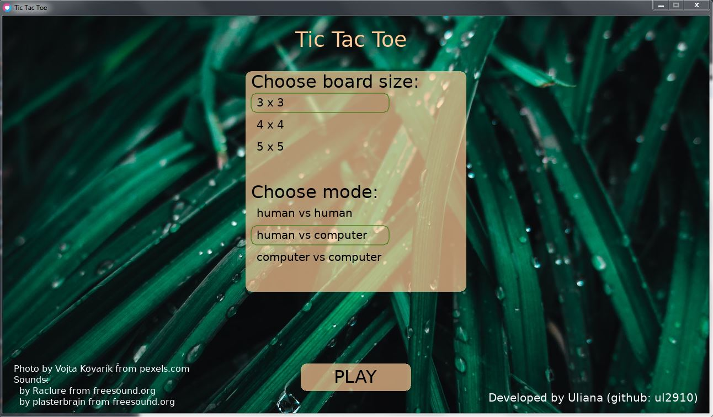
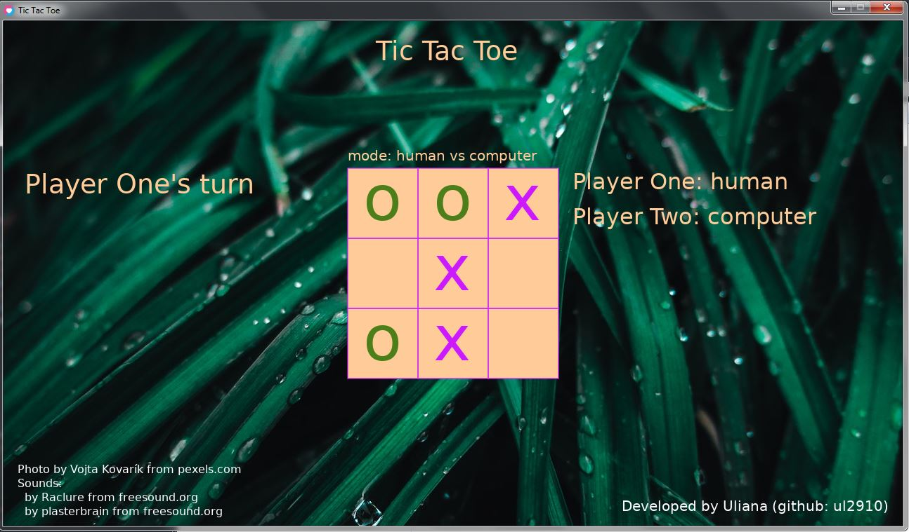
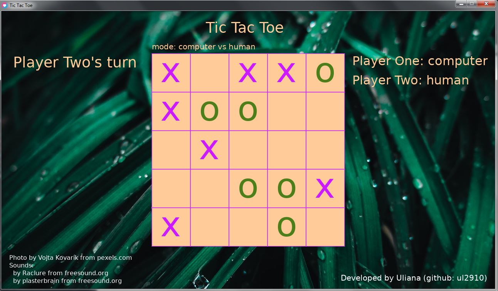

# TicTacToe
### Classic game in Lua with LÖVE

#### Description:
3 board sizes and 3 modes available:
Modes: human vs human, human vs computer, computer vs computer.
Board sizes: 3x3, 4x4, 5x5.
Win - 3/4/5 in a row respectively.

In case of human vs computer mode, who will go first has a random chance of 50%.
AI algorithm is unbeatable, 3x3 mode uses recursive minimax algorithm with alpha-beta pruning. 
4x4 - first couple of moves is random, then minimax.
5x5 - random, then it doesn't let the opponent win, then minimax, otherwise recursion would be really slow.

Minimax Algorithm in Game Theory (Alpha-Beta Pruning):
https://www.geeksforgeeks.org/minimax-algorithm-in-game-theory-set-4-alpha-beta-pruning/

#### Screenshots:

